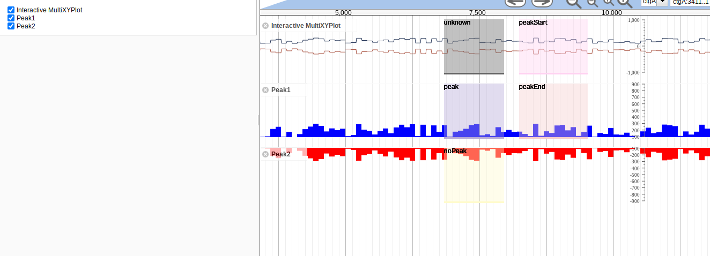

# interactive_peak_annotator

A method for interactively annotating peaks

## Install

- Clone repo into plugins folder in JBrowse and name folder InteractivePeakAnnotator
- Add "plugins": ["InteractivePeakAnnotator"] to trackList.json or jbrowse_conf.json

Please see http://gmod.org/wiki/JBrowse_FAQ#How_do_I_install_a_plugin for more information about installing plugins

Relies on WiggleHighlighter to be installed also https://github.com/cmdcolin/wigglehighlighter

## Demo

See http://localhost/?data=plugins/InteractivePeakAnnotator/test/data once you have installed for small demo dataset

